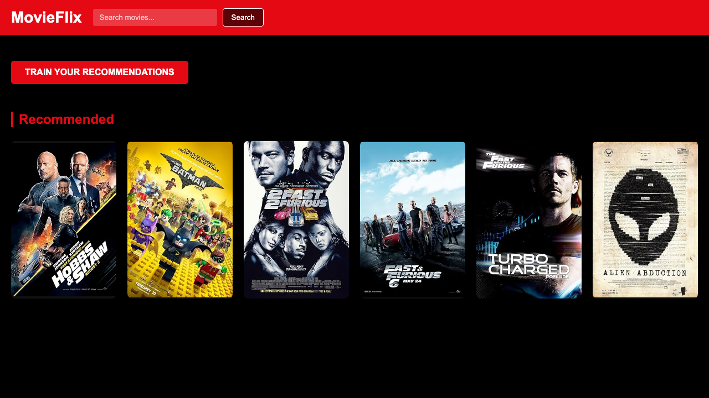

# 🎬 MovieFlix - Movie Recommendation System

## 📌 Overview
A Flask-based web application that recommends movies based on user preferences. It provides an interactive UI and smooth user experience.

## 🚀 Features
- **Movie recommendation system**: Provides personalized movie suggestions.
- **Clean and responsive UI**: Beautiful interface that works seamlessly across devices.
- **Flask backend integration**: Robust and efficient Python backend to serve dynamic content.
- **Dynamic content rendering**: Fast and interactive browsing experience using Jinja templates.

## 🛠️ Tech Stack
- **Backend**: Python (Flask, SQLite)
- **Frontend**: HTML, CSS, JavaScript, Bootstrap
- **Data Integration**: OMDB/TMDB APIs for fetching movie data

## 📂 Project Structure
- `app.py`: The main Flask application defining backend routes, database interaction, and logic.
- `templates/`: Contains all HTML templates (e.g., `recommendations.html`, `swipe.html`, `movie_details.html`).
- `static/`: Stores static assets such as CSS styles and JavaScript logic.
- `screenshots/`: Visual captures of the web application in action.
- `main_movies.json` / `poster_data.json`: Local static JSON data for movie caching and initial load.

## 📸 Screenshots




## ⚙️ Installation

1. **Clone the repository**:
   ```bash
   git clone https://github.com/AnkitKumar729/MovieFlix.git
   cd MovieFlix
   ```
2. **Install dependencies**:
   *(Assuming standard Python dependencies used in the project)*
   ```bash
   pip install flask requests numpy
   ```
3. **Initialize the Database**:
   The `movieflix.db` local SQLite database will dynamically be populated and handled.

## ▶️ How to Run
```bash
python app.py
```
After executing, navigate to `http://127.0.0.1:8000/` in your web browser.

## 📈 Future Improvements
- Add user login to support multiple user profiles natively
- Improve recommendation accuracy with more advanced machine learning modules
- Integrate real-time streaming link availability APIs dynamically

## 👨💻 Author
Ankit Kumar
